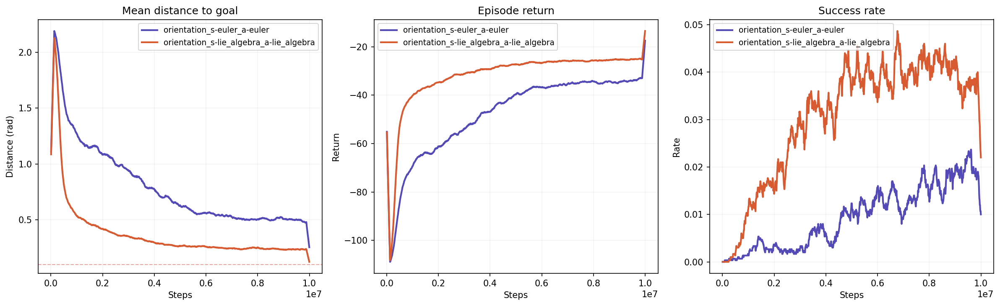
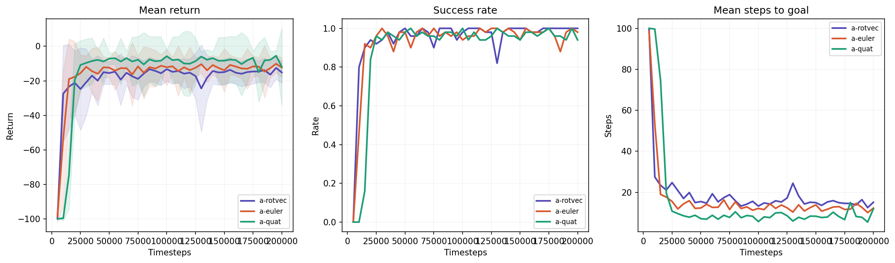
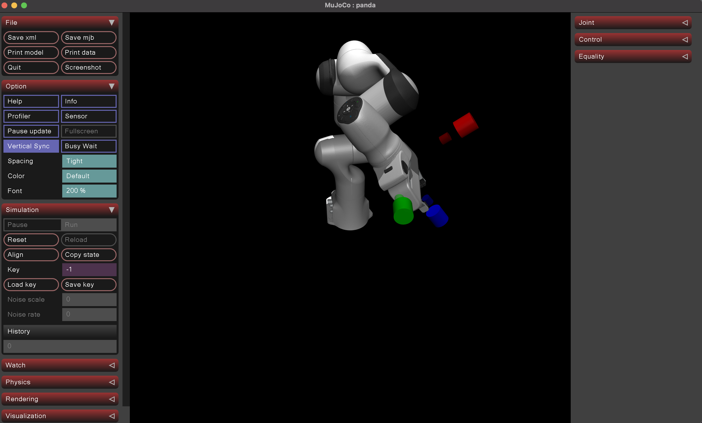

# Lie Group Orientations for Reinforcement Learning in Robotics

An independent reproduction and investigation of [Schuck et al., 2024](https://arxiv.org/abs/2409.11935) — *"Reinforcement Learning with Lie Group Orientations for Robotics"* (arXiv: 2409.11935).

I couldn't find public implementation of this paper at the time of writing. This repo is an attempt at a clean code, minimal reproduction using established libraries only — no custom rotation math, no custom RL, no hand-written robot models.

## Paper Summary

The paper claims that using the **Lie algebra (axis-angle / rotvec)** as the orientation representation in RL networks trains faster than Euler angles, quaternions, or rotation matrices. The key modification:

```
State s ∈ SO(3) → Log(s) = τ ∈ ℝ³ → [Neural Network] → ᵃτ ∈ ℝ³ → Exp(ᵃτ) = a ∈ SO(3) → s' = s · a
```

In practice: `Exp` = `scipy.Rotation.from_rotvec()`, `Log` = `scipy.Rotation.as_rotvec()`. The Lie algebra of SO(3) is the rotation vector (axis-angle) representation — a plain ℝ³ vector where direction = rotation axis, magnitude = rotation angle.

## Results

I reproduce two of the paper's three tasks using TD3 + Hindsight Experience Replay (HER) with sparse reward.

### Task A: Direct Orientation Control

Pure rotation control — no robot embodiment. The agent applies incremental rotation actions to rotate a frame from an initial orientation to a goal orientation. This matches Section IV-A of the paper.




### Task B: End-Effector Orientation Control (Franka Panda)

7-DoF Franka Panda arm rotating its end-effector to a goal orientation via damped Jacobian IK. Uses the [MuJoCo Menagerie](https://github.com/google-deepmind/mujoco_menagerie) Franka model with correct kinematics and inertias. This matches Section IV-B of the paper.



**Observations:**
- Both representations solve the task, consistent with the paper's Figure 4 (bottom row) where gaps between representations are much smaller than Task A
- The IK layer between the network output and actual robot motion absorbs most of the representation differences
- The paper's main claim — that action representation matters more than state representation — is confirmed, but the practical difference is small for the embodied task

### Visualization



The MuJoCo viewer shows RGB axes at the EE: thick bright axes = goal orientation, thin faded axes = current orientation. As training progresses, the agent learns to align them.

## Discussion

 The communities that genuinely need Lie groups for network outputs (SE(3) diffusion policies for grasp generation — SE(3)-DiffusionFields, EquiGraspFlow, ET-SEED, Diffusion-EDFs) already use Exp/Log maps as standard practice since 2023

## Project Structure

```
├── train.py                  # TD3+HER training (SB3 wrapper)
├── plot.py                   # Plot evaluations.npz comparison
├── visualize.py              # MuJoCo viewer with goal frame visualization
├── test_franka.py            # 19 tests (TDD — run before training)
├── debug_ik.py               # IK frame convention diagnostic
├── envs/
│   └── franka_orientation.py # GoalEnv using Menagerie Franka Panda
├── utils/
│   └── rotations.py          # Thin scipy.Rotation wrapper (62 lines)
├── configs/
│   ├── rotvec.yaml           # Lie algebra (paper's method)
│   ├── euler.yaml            # Euler angles baseline
│   └── quat.yaml             # Quaternion baseline
├── requirements.txt
├── LICENSE
└── .gitignore
```

## Setup

```bash
pip install -r requirements.txt
```

The Franka Panda model is loaded automatically from MuJoCo Menagerie via `robot_descriptions` — no manual download needed.

## Usage

### Tests first
```bash
python test_franka.py
```
19 tests covering: model loading, forward kinematics, Jacobian computation, IK convergence, rotation utilities, actuator control, and full env integration.

### Train
```bash
# Lie algebra (rotvec) — paper's proposed method
python train.py --config configs/rotvec.yaml

# Euler angles
python train.py --config configs/euler.yaml

# Quaternions
python train.py --config configs/quat.yaml

# Quick debug run (~2 min)
python train.py --config configs/rotvec.yaml --total-timesteps 5000 --eval-freq 1000 --n-eval-episodes 5
```

### Plot
```bash
python plot.py runs/td3_her_a-rotvec*/evaluations.npz \
               runs/td3_her_a-euler*/evaluations.npz \
               runs/td3_her_a-quat*/evaluations.npz
```

### Visualize
```bash
mjpython visualize.py --random                                          # random actions
mjpython visualize.py --model runs/td3_her_a-rotvec*/best_model.zip     # trained model
```

## Acknowledgments

This project is built entirely on established open-source libraries:

- **[MuJoCo](https://github.com/google-deepmind/mujoco)** — Physics engine for simulation ([Todorov et al., 2012](https://ieeexplore.ieee.org/document/6386109))
- **[MuJoCo Menagerie](https://github.com/google-deepmind/mujoco_menagerie)** — Curated collection of high-quality robot models, including the Franka Emika Panda used in this work ([Zakka et al., 2022](https://github.com/google-deepmind/mujoco_menagerie))
- **[robot_descriptions](https://github.com/robot-descriptions/robot_descriptions.py)** — Python package for loading robot models from Menagerie and other collections
- **[Stable Baselines3](https://github.com/DLR-RM/stable-baselines3)** — RL library providing TD3 and HerReplayBuffer ([Raffin et al., 2021](https://jmlr.org/papers/v22/20-1364.html))
- **[Gymnasium](https://github.com/Farama-Foundation/Gymnasium)** — Standard RL environment API
- **[SciPy](https://github.com/scipy/scipy)** — `scipy.spatial.transform.Rotation` for all rotation math (Exp, Log, geodesic distance)

## Citation

```bibtex
@article{schuck2024reinforcement,
  title={Reinforcement Learning with Lie Group Orientations for Robotics},
  author={Schuck, Martin and Br{\"u}digam, Jan and Hirche, Sandra and Schoellig, Angela},
  journal={arXiv preprint arXiv:2409.11935},
  year={2024}
}
```

## License

MIT